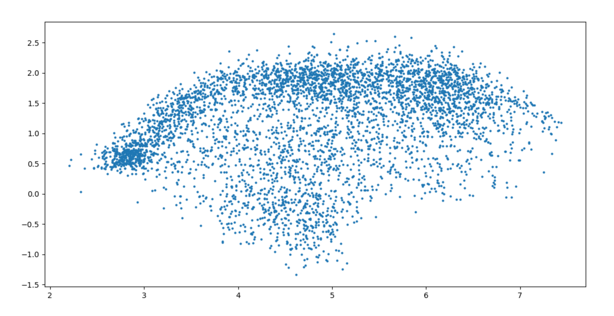

PAV - P4: reconocimiento y verificación del locutor
===================================================

Obtenga su copia del repositorio de la práctica accediendo a [Práctica 4](https://github.com/albino-pav/P4)
y pulsando sobre el botón `Fork` situado en la esquina superior derecha. A continuación, siga las
instrucciones de la [Práctica 2](https://github.com/albino-pav/P2) para crear una rama con el apellido de
los integrantes del grupo de prácticas, dar de alta al resto de integrantes como colaboradores del proyecto
y crear la copias locales del repositorio.

También debe descomprimir, en el directorio `PAV/P4`, el fichero [db_8mu.tgz](https://atenea.upc.edu/pluginfile.php/3145524/mod_assign/introattachment/0/spk_8mu.tgz?forcedownload=1)
con la base de datos oral que se utilizará en la parte experimental de la práctica.

Como entrega deberá realizar un *pull request* con el contenido de su copia del repositorio. Recuerde
que los ficheros entregados deberán estar en condiciones de ser ejecutados con sólo ejecutar:

~~~~~~~~~~~~~~~~~~~~~~~~~~~~~~~~~~~~~~~~~~~~~~~~~~~~~.sh
  make release
  run_spkid mfcc train test classerr verify verifyerr
~~~~~~~~~~~~~~~~~~~~~~~~~~~~~~~~~~~~~~~~~~~~~~~~~~~~~

Recuerde que, además de los trabajos indicados en esta parte básica, también deberá realizar un proyecto
de ampliación, del cual deberá subir una memoria explicativa a Atenea y los ficheros correspondientes al
repositorio de la práctica.

A modo de memoria de la parte básica, complete, en este mismo documento y usando el formato *markdown*, los
ejercicios indicados.

## Ejercicios.

### SPTK, Sox y los scripts de extracción de características.

- Analice el script `wav2lp.sh` y explique la misión de los distintos comandos, y sus opciones, involucrados
  en el *pipeline* principal (`sox`, `$X2X`, `$FRAME`, `$WINDOW` y `$LPC`).

  * sox: Convierte la señal de entrada un formato concreto de b bits con o sin cabecera. Se puede elegir si tiene cabecera o no, el formato de la señal, los bits utilizados entre muchas otras cosas, básicamente como se desea la señal de entrada.
  * X2X : es el programa de SPTK que permite la conversión entre distintos formatos de datos. 
  * FRAME: divide la señal de entrada en tramas de l muestras con desplazamiento de ventana de p muestras que se le indiquen y también puede elegir si el punto de comienzo es centrado o no.
  * WINDOW: Multiplica cada trama por una ventana. Se puede elegir el numero l de muestras por trama del fichero de entrada y salida, el  tipo de normalización y el tipo de ventana que se quiere utilizar. 
  * LPC: Calcula los lpc_order primeros coeficientes de predicción lineal, precedidos por el factor de ganancia del predictor. Se puede escoger el numero l de muestras por trama, el orden del LPC y el valor mínimo del determinante de la matriz normal.

- Explique el procedimiento seguido para obtener un fichero de formato *fmatrix* a partir de los ficheros
  de salida de SPTK (líneas 41 a 47 del script `wav2lp.sh`).

  Primero se extraen las características necesarias de la señal:
  + sox $inputfile -t raw -e signed -b 16 - : Convierte la señal de entrada a reales en coma flotante de 16 bits sin cabecera.
  + $X2X +sf : permite la conversión entre formatos de datos para la siguiente orden
  + $FRAME -l 240 -p 80 : divide la señal de entrada en tramas de 240 muestras con desplazamiento de ventana de 80 muestras
  + $WINDOW -l 240 -L 240 : Multiplica cada trama por una ventana Blackman con 240 muestras por trama tanto del fichero de entrada como del fichero de salida.
  + $LPC -l 240 -m $lpc_order : Calcula los lpc_order primeros coeficientes de predicción lineal, con 240 muestras por trama y la variable $lpc_order indica el orden del LPC.
  + $base.lp: la redirección permite redirigir la salida de un comando a un fichero que en este caso es base.lp

  Para realizar todos estos comandos se utiliza el encadenado que hace que la salida estándar de un comando se utilice como la entrada estándar del siguiente.

  En el fichero de formato *fmatrix* se realiza la parametrización de una señal de voz usando coeficientes de predicción lineal, en el que hay que poner el número de filas y de columnas, seguidos por los datos.
  + El número de columnas (igual al número de coeficientes) se calcula a partir del orden del predictor lineal que es igual a uno más el orden ya que en el primer elemento del vector se almacena la ganancia de predicción.
  + El número de filas (igual al número de tramas) depende de la longitud de la señal, la longitud y desplazamiento de la ventana, y la cadena de comandos que se ejecutan para obtener la parametrización. Pero podemos extraer esa información del fichero obtenido. Lo hacemos convirtiendo la señal parametrizada a texto, usando sox +fa, y contando el número de líneas, con el comando de UNIX wc -l.

  - ¿Por qué es conveniente usar este formato (u otro parecido)?
    Los datos se almacenan en nrow filas de ncol columnas, en los que cada fila corresponde a una trama de señal, y cada columna a cada uno de los coeficientes con los se parametriza la trama. Así tenemos todos coeficientes de la señal a analizar en las diferenes columnas y podemos mostrarlos con el programas fmatrix_show y elegir los coeficientes 2 y 3, que son los que nos piden, con fmatrix_cut.
    

- Escriba el *pipeline* principal usado para calcular los coeficientes cepstrales de predicción lineal
  (LPCC) en su fichero <code>scripts/wav2lpcc.sh</code>:

  * LPC2C : transforma LPC to cepstrum. Se puede elegir el orden del LPC y el orden del cepstrum.

  <code>sox $inputfile -t raw -e signed -b 16 - | $X2X +sf | $FRAME -l 240 -p 80 | $WINDOW -l 240 -L 240 |
	 $LPC -l 240 -m $lpc_order | $LPC2C -m $lpc_order -M $nceps > $base.lpcc</code>

- Escriba el *pipeline* principal usado para calcular los coeficientes cepstrales en escala Mel (MFCC) en
  su fichero <code>scripts/wav2mfcc.sh</code>:

  * MFCC: analisis MFCC. Se puede elegir entre otras cosas el numero l de muestras por trama, el orden m del cepstrum, el coefficiente de liftering, el orden del canal para el mel-filter bank o la frecuencia de muestreo.

  <code>sox $inputfile -t raw -e signed -b 16 - | $X2X +sf | $FRAME -l 240 -p 80 | $MFCC -s 8000 -n $nfilter -l 240 -m $mfcc_order > $base.mfcc </code>

### Extracción de características.

- Inserte una imagen mostrando la dependencia entre los coeficientes 2 y 3 de las tres parametrizaciones
  para una señal de prueba.
  
  Para el caso de la parametrización LP hemos obtenido:
  

  Para el caso de la parametrización LPCC hemos obtenido:
  

  Para el caso de la parametrización MFCC hemos obtenido:
  

  + ¿Cuál de ellas le parece que contiene más información?

    Creo que contiene más información la parametrización LPCC y la MFCC ya que los coeficientes estan menos correlados y por lo tanto, a partir de un coeficiente no podemos determinar el otro, por lo que hay más información necesaria.

- Usando el programa <code>pearson</code>, obtenga los coeficientes de correlación normalizada entre los
  parámetros 2 y 3, y rellene la tabla siguiente con los valores obtenidos.

  |                        |      LP     |     LPCC    |    MFCC     |
  |------------------------|:-----------:|:-----------:|:-----------:|
  | &rho;x[2,3] |  -0.872284  |   0.160985  |  -0.59706   |
  
  + Compare los resultados de <code>pearson</code> con los obtenidos gráficamente.

    Un valor absoluto de rho cercano a 1 indica que los dos coeficientes están muy correladas entre sí. 
    Por ejemplo, el valor de LP, que es cercano a 1, implica que conociendo uno de los dos podemos determinar el valor del otro, por lo que la información conjunta proporcionada por las dos componentes es prácticamente la misma que la proporcionada por sólo una.
    
    Un valor absoluto de rho cercano a 0 indica que los dos coeficientes están poco correladas entre sí. 
    Por ejemplo, el valor de LPCC, que es cercano a 0, implica que la información conjunta proporcionada por ambas es el doble de la proporcionada por sólo una de ellas.

    Por lo que podemos ver igual que en las gráficas obtenidas anteriormente que la parametrización LP es bastante correlada y la parametrización LPCC y MFCC no lo son tanto. Aunque son los coeficientes vemos que la menos correlada es la parametrización LPCC.
    
  
- Según la teoría, ¿qué parámetros considera adecuados para el cálculo de los coeficientes LPCC y MFCC?

  + Para los coeficientes LPCC se usa lpc_order=8, como esta definido en la función compute_lp(), y el número de cepstrum es igual a 3*P/2 donde P=lpc_order=8 , por lo tanto, nceps=12. Finalmente, hemos decidido incrementar estos valores para obtener mejores resultados.
  + Para los coeficientes MFCC se usan los primeros 13 coefficientes + un 50% más, por lo tanto mfcc_order=19. I el numero de filtros suele ir de 24 a 40, por lo que usamos un valor intermedio de nfilter=30.

### Entrenamiento y visualización de los GMM.

Complete el código necesario para entrenar modelos GMM.

- Inserte una gráfica que muestre la función de densidad de probabilidad modelada por el GMM de un locutor
  para sus dos primeros coeficientes de MFCC.

  
  
- Inserte una gráfica que permita comparar los modelos y poblaciones de dos locutores distintos (la gŕafica
  de la página 20 del enunciado puede servirle de referencia del resultado deseado). Analice la capacidad
  del modelado GMM para diferenciar las señales de uno y otro.

  |  |  |
  | ------------ | ------------- |
  |  |  |

### Reconocimiento del locutor.

Complete el código necesario para realizar reconociminto del locutor y optimice sus parámetros.

- Inserte una tabla con la tasa de error obtenida en el reconocimiento de los locutores de la base de datos
  SPEECON usando su mejor sistema de reconocimiento para los parámetros LP, LPCC y MFCC.

  Para el caso de la parametrización LP hemos obtenido:
  
  
  Para el caso de la parametrización LPCC hemos obtenido:
  

  Para el caso de la parametrización MFCC hemos obtenido:
  

### Verificación del locutor.

Complete el código necesario para realizar verificación del locutor y optimice sus parámetros.

- Inserte una tabla con el *score* obtenido con su mejor sistema de verificación del locutor en la tarea
  de verificación de SPEECON. La tabla debe incluir el umbral óptimo, el número de falsas alarmas y de
  pérdidas, y el score obtenido usando la parametrización que mejor resultado le hubiera dado en la tarea
  de reconocimiento.
  
  La parametrización que ha dado mejor resultado es la LPCC:

       ==============================================
        THR: 0.940474564897601
        Missed:     44/250=0.1760
        FalseAlarm: 0/1000=0.0000
        ----------------------------------------------
        ==> CostDetection: 17.6
        ==============================================

  La parametrización MFCC  nos da el resultado siguiente:

      ==============================================
        THR: 2.33881544478942
        Missed:     145/250=0.5800
        FalseAlarm: 0/1000=0.0000
        ----------------------------------------------
        ==> CostDetection: 58.0
        ==============================================
  Para la parametrización LP el serultado es:

      ==============================================
        THR: 1.3520980098306
        Missed:     224/250=0.8960
        FalseAlarm: 0/1000=0.0000
        ----------------------------------------------
        ==> CostDetection: 89.6
        ==============================================
 
  Los resultados anteriores se han obenido usando 20 coeficientes. Con 25 coeficientes el resultado para la parametrización MFCC mejora, pero la LPCC empeora mucho. En abmos casos, los resultados para la paramterización LP són los peores.
### Test final y trabajo de ampliación.

- Recuerde adjuntar los ficheros `class_test.log` y `verif_test.log` correspondientes a la evaluación
  *ciega* final.

- Recuerde, también, enviar a Atenea un fichero en formato zip o tgz con la memoria con el trabajo
  realizado como ampliación, así como los ficheros `class_ampl.log` y/o `verif_ampl.log`, obtenidos como
  resultado del mismo.
